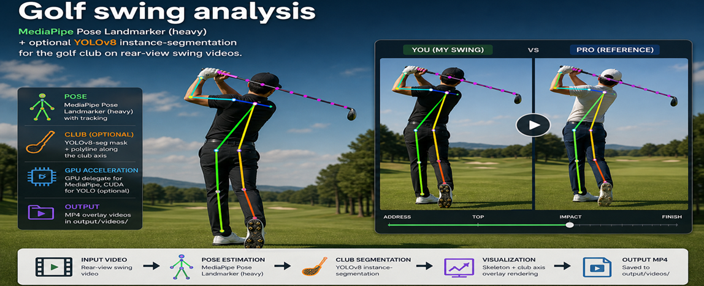

# Golf swing analysis

<p align="center">
  
</p>

Overlays **MediaPipe Pose Landmarker (heavy)** and an optional **YOLOv8 instance-segmentation** model for the golf club on rear-view swing videos. Writes an MP4 to `output/videos/`.

---

## Features

- **Pose**: MediaPipe Pose Landmarker (TFLite), video mode with tracking; GPU delegate when available.
- **Club** (optional): YOLOv8-seg mask, polyline along the club axis (`--club-samples`, default 8).
- **Offline-first**: By default only files under `data/models/` are used; see below.

## Requirements

- Python **3.10+** (tested on 3.13)
- Dependencies: see [`requirements.txt`](./requirements.txt)
- **PyTorch**: install the build that matches your platform ([PyTorch install](https://pytorch.org/)). CUDA optional but recommended for YOLO inference.

## Installation

```bash
python -m venv venv
# Windows: venv\Scripts\activate
# Unix:    source venv/bin/activate

pip install -r requirements.txt
```

## Usage

Paths are relative to the **repository root**, or absolute.

```bash
# Pose + club (expects data/models/yolov8_club_seg.pt and pose_landmarker_heavy.task)
python scripts/main.py --myswing data/videos/your_swing.mp4

# Pose only (no club weights needed)
python scripts/main.py --myswing data/videos/your_swing.mp4 --no-club

# Side-by-side comparison
python scripts/main.py --myswing data/videos/you.mp4 --proswing data/videos/reference.mp4

# Custom club weights
python scripts/main.py --myswing data/videos/you.mp4 --club-model path/to/weights.pt
```

Outputs:

- `output/videos/<stem>_swing_overlay.mp4`
- With `--proswing`: `output/videos/compare_<left>_vs_<right>_swing_overlay.mp4`

### Offline mode (`--off-line-only`, **default: on**)

By default the script **does not download** missing models. Put assets under `data/models/`:

| File | Role |
|------|------|
| `pose_landmarker_heavy.task` | MediaPipe pose |
| `yolov8_club_seg.pt` | Club segmentation (fine-tuned; see training below) |

To **allow downloading** missing files when needed (pose `.task` from Google). **`data/models/yolov8_club_seg.pt` is bundled with this repository**; if that default club file is still missing, a **pretrained** `yolov8n-seg.pt` is fetched instead — not your fine-tuned weights.

```bash
python scripts/main.py --myswing data/videos/your_swing.mp4 --no-off-line-only
```

For a **custom** `--club-model` path that does not exist, the tool exits with an error even with `--no-off-line-only` (place the file manually).

## Training your own club model (optional)

1. Prepare frames and segment labels: `python scripts/club_dataset.py` (see script help).
2. Train: `python scripts/train_yolov8_club.py --dataset data/datasets/golf_club_seg`
3. Copy or symlink the produced weights to `data/models/yolov8_club_seg.pt` (the training script can copy `best.pt` there depending on configuration).

Training artifacts go under `output/train/<run_name>/` by default. Use `--plots` on the training script if you want extra PNG diagnostics.

## Repository layout (short)

```
scripts/main.py          # CLI entry
scripts/club_dataset.py  # dataset extract / annotate / verify
scripts/train_yolov8_club.py
src/                     # pose, club detection, rendering
data/models/             # local weights (gitignored binaries)
data/videos/             # input videos (typically gitignored)
output/videos/           # rendered MP4s
```

## License

[MIT](./LICENSE)
